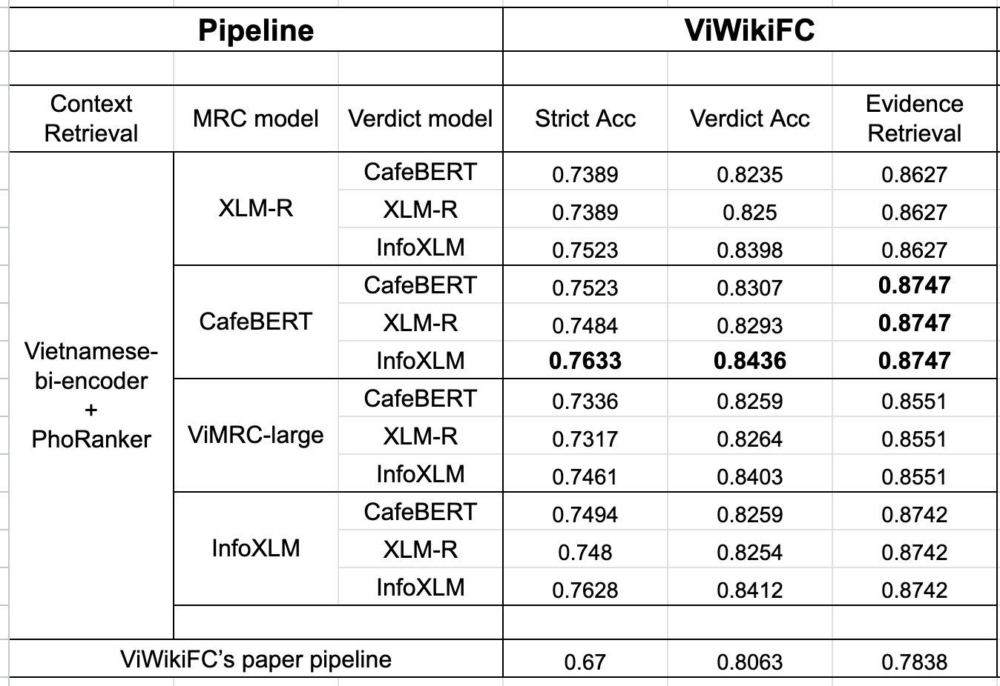

<p align="center">
  <a href="https://www.uit.edu.vn/" title="Trường Đại học Công nghệ Thông tin">
    
  </a>
</p>


# **ViAutoFactCheck: Integrating Context Retrieval and Machine Reading Comprehension for Automated Fact Verification**  

### **Authors**
- Ngô Thành Trung  
- Đinh Nhật Trường  

### **Supervisors**
- ThS. Huỳnh Văn Tín  
- TS. Nguyễn Văn Kiệt  

---

### **Background & Motivation**

In today's information-rich world, the rapid spread of news, social media posts, and online content has made it increasingly difficult to discern true information from false or misleading claims. **Fact-checking** is essential to ensure the credibility of information, prevent misinformation, and support informed decision-making in society. 

This challenge motivates the need for **Automated Fact-Checking systems**, which leverage natural language processing (NLP) and machine learning techniques to:  
- **Retrieve relevant evidence** from large knowledge bases efficiently.  
- **Understand and extract information** using machine reading comprehension models.  
- **Verify claims automatically** by comparing statements with retrieved evidence.

---

### **Project Overview**

**ViAutoFactCheck** is an end-to-end automated fact verification pipeline that integrates three key components to verify claims efficiently and accurately:

1. **Information Retrieval (IR)**  
   - Retrieves relevant documents or context from a large knowledge base based on the input claim.  
   - Ensures the system has the most relevant evidence before verification.

2. **Machine Reading Comprehension (MRC)**  
   - Extracts precise information or answers from the retrieved context.  
   - Understands the content to identify evidence supporting or refuting the claim.
   - **Leverages sliding window splitting** to handle long contexts efficiently, ensuring no important information is missed.

3. **Text Classification**  
   - Compares the extracted evidence with the original claim.  
   - Assigns a label such as *Supported*, *Refuted*, or *Not Enough Information*.

These components work together in a seamless, automated pipeline to perform **robust fact verification** without manual intervention.

We perform experiments on various number of State-of-the-art (SOTA) models such as [CafeBERT](https://huggingface.co/uitnlp/CafeBERT), [XLM-R](https://huggingface.co/FacebookAI/xlm-roberta-large), [InfoXLM](https://huggingface.co/microsoft/infoxlm-large), [Vi-MRC](https://huggingface.co/nguyenvulebinh/vi-mrc-large), v.v and tested the pipeline on [ViWikiFC](https://arxiv.org/abs/2405.07615).

---

### **Information Retrieval (IR)**

The Information Retrieval component is responsible for finding relevant context for a given claim from a large knowledge base.  
ViAutoFactCheck uses a **two-stage retrieval strategy** for optimal performance:

1. **Bi-Encoder Retrieval**  
   - Uses the [`bkai-foundation-models/vietnamese-bi-encoder`](https://huggingface.co/bkai-foundation-models/vietnamese-bi-encoder) to encode claims and documents into embeddings.  
   - Retrieves the **top 50 most relevant documents** efficiently using cosine similarity.

2. **Cross-Encoder Re-Ranking**  
   - Uses the [`itdainb/PhoRanker`](https://huggingface.co/itdainb/PhoRanker) cross-encoder to score the relevance of candidate documents with respect to the claim.  
   - Selects the **top 1–5 documents** for downstream MRC processing, ensuring high-quality evidence.

This **two-stage IR approach** balances efficiency and accuracy, leveraging the speed of bi-encoders with the precision of cross-encoders.

---

### **2. Machine Reading Comprehension (MRC)**

The MRC component is responsible for extracting precise evidence or answers from the retrieved context. This is also known as **span-based extraction**, where the model identifies and extracts a specific span of text from the context.


We trained and evaluated several state-of-the-art models:  
- [CafeBERT](https://huggingface.co/uitnlp/CafeBERT)  
- [XLM-R](https://huggingface.co/FacebookAI/xlm-roberta-large)  
- [InfoXLM](https://huggingface.co/microsoft/infoxlm-large)  
- [Vi-MRC](https://huggingface.co/nguyenvulebinh/vi-mrc-large)  

To handle long contexts that exceed the model's maximum input length, we experimented with two strategies:  
1. **Hard Split Context** – Split the context strictly based on the **length of the stripped context**
- *Stripped context* refers to the context text after removing unnecessary characters, extra spaces, or formatting tokens, keeping only the clean textual content for accurate token length calculation.  
2. **Sliding Window** – Split the context with an **overlap of 100 tokens**, ensuring no important information is lost.  
- *Sliding window* refers to moving a fixed-length window over the stripped context so that consecutive segments share 100 tokens, allowing the model to see context spanning across splits.

> All token lengths are calculated using the respective model's tokenizer.

This setup allows the MRC module to extract accurate evidence even from very long documents, balancing context coverage and model capacity.

---

### **3. Text Classification**

The Text Classification component verifies claims using the evidence extracted from the MRC module.  

We trained [CafeBERT](https://huggingface.co/uitnlp/CafeBERT), [XLM-R](https://huggingface.co/FacebookAI/xlm-roberta-large), and [InfoXLM](https://huggingface.co/microsoft/infoxlm-large) to predict labels based on the combination of the claim and the extracted evidence. 

The possible labels are:  
- **Supported** – Evidence confirms the claim.  
- **Refuted** – Evidence contradicts the claim.  
- **Not Enough Information (NEI)** – Retrieved context is insufficient to verify the claim.

---

### **Dataset**

For training and evaluating ViAutoFactCheck, we use the [ViWikiFC](https://arxiv.org/abs/2405.07615), a Vietnamese fact-checking benchmark.  

|           | ViWikiFC | ViNumFC |
|-----------|---------:|--------:|
| **Train** | 16,738   | 8,004   |
| **Dev**   | 2,090    | 999     |
| **Test**  | 2,091    | 1,005   |

Each claim is paired with relevant context and evidence, and labeled as **Supported**, **Refuted**, or **Not Enough Information (NEI)**.  
This dataset is suitable for training all three components of the pipeline:  
- **Information Retrieval (IR)** – to retrieve relevant context, from claim-context pairs.
- **Machine Reading Comprehension (MRC)** – to extract precise evidence with claim-context and evidence.  
- **Text Classification** – to predict the final claim label with claim-evidence.

---

## **Evaluation**

We evaluate **ViAutoFactCheck** at both the component level and the end-to-end pipeline level using standard metrics for retrieval, reading comprehension, classification, and claim verification.

### **1. Information Retrieval (IR)**

- **MRR@10 (Mean Reciprocal Rank)** – Measures the quality of general retrieval by evaluating the rank of the first relevant document among the top 10 retrieved documents.  
- **ACC@1 and ACC@2** – Measure the accuracy of hard, precise retrieval by checking whether the top 1 or top 2 retrieved documents contain the actual relevant evidence. In real-world applications, retrieving more documents increases the system's runtime, so limiting to the top 1–2 strikes a balance between accuracy and efficiency.


### **2. Machine Reading Comprehension (MRC)**

- **Exact Match (EM)** – Evaluates the ability of the MRC module to extract precise evidence by measuring the percentage of predictions that exactly match the reference answer span.

### **3. Text Classification (CLS)**

- **Accuracy** – Measures the percentage of claims that are correctly classified as *Supported*, *Refuted*, or *Not Enough Information*.  
- **F1 Score** – Captures the balance between precision and recall for classification, especially useful when labels are imbalanced.

### **4. End-to-End Pipeline**

The full pipeline is evaluated using claim verification metrics:  
- **Strict Accuracy (Strict Acc)** – Counts claims as correct only if both the predicted label and the retrieved evidence are correct.  
- **Evidence Retrieval Accuracy (ER Acc)** – Measures the ability to retrieve correct supporting evidence, regardless of the predicted label.  
- **Verification Classification Accuracy (VC Acc)** – Measures the accuracy of the predicted claim label, regardless of whether the retrieved evidence is exactly correct.

> This evaluation framework ensures that each module performs well individually and that the full pipeline reliably verifies claims using retrieved evidence.

## **Results**

We evaluate our full pipeline on the **ViWikiFC** dataset and compare it with the original pipeline reported in the ViWikiFC paper.

<p align="center">
  
</p>
<p align="center"><i>Evaluation on ViWikiFC with SoTA models</i></p>


Across all configurations, **InfoXLM consistently delivers the strongest performance** as both an MRC model and a verdict (classification) model. When paired with the *Vietnamese-bi-encoder + PhoRanker* retriever, the best-performing pipeline uses **CafeBERT (for MRC) + InfoXLM (for Verdict Classification)**, achieving:

- **Strict Accuracy:** **0.7633**  
- **Verdict Accuracy:** **0.8436**  
- **Evidence Retrieval:** **0.8747**

These results show a clear improvement over the original **ViWikiFC** paper, which reports:

- **Strict Accuracy:** 0.67  
- **Verdict Accuracy:** 0.8063  
- **Evidence Retrieval:** 0.7838  

Overall, our pipeline improves **Strict Acc (+9.3%)**, **Verdict Acc (+3.7%)**, and **Evidence Retrieval (+9.1%)** compared to the original baseline. This demonstrates that combining strong retrieval (PhoRanker), robust span extraction (CafeBERT), and powerful multilingual representations (InfoXLM) leads to a significantly more effective fact-verification system.

---
## **Example Usage**

This example demonstrates how to use the ViAutoFactCheck inference pipeline with a claim and a context.  

**Note:** This example only uses the **Machine Reading Comprehension (MRC)** and **Sequence Classification (CLS)** modules. The **Information Retrieval (IR)** module, which fetches relevant contexts from the knowledge base, will be made public later due to copyright restrictions on the training data. 

We recommend using transformers 4.55.2.

```python
pip install transformers==4.55.2
```
```python
import torch
from transformers import AutoTokenizer, AutoModelForQuestionAnswering, AutoModelForSequenceClassification
import re

# -----------------------
# CONFIG
# -----------------------
QA_MODEL = "ICTuniverse/CafeBERT-QA-viwikifc-9321-EM"
CLS_MODEL = "ICTuniverse/infoxlm-FC-viwikifc-8723-Acc"
DEVICE = torch.device("cuda" if torch.cuda.is_available() else "cpu")
MAX_LENGTH = 512
WINDOW_SIZE = 480
MIN_STRIDE = 200
LABEL_ID2NAME = {0: "Support", 1: "Refute", 2: "NEI"}

# -----------------------
# Simple utils
# -----------------------
def tok_len_pair(claim, context, tokenizer):
    return tokenizer(claim, context, truncation=False, add_special_tokens=True, padding=False, return_length=True)["length"][0]

def context_ids_no_specials(text, tokenizer):
    return tokenizer(text, add_special_tokens=False)["input_ids"]

def decode_ids(ids, tokenizer):
    return tokenizer.decode(ids, skip_special_tokens=True, clean_up_tokenization_spaces=True)

def create_subcontexts_sliding_window(claim, context, tokenizer, max_len=MAX_LENGTH):
    if tok_len_pair(claim, context, tokenizer) <= max_len:
        return [context.strip()]
    ctx_ids = context_ids_no_specials(context, tokenizer)
    claim_tok_len = len(tokenizer(claim, add_special_tokens=False)["input_ids"])
    reserve = claim_tok_len + 3
    window_size = min(WINDOW_SIZE, max_len - reserve)
    stride = max(MIN_STRIDE, int(window_size * 0.33))
    step = window_size - stride
    if step <= 0:
        step = max(1, window_size // 2)
    subcontexts = []
    for start in range(0, len(ctx_ids), step):
        end = start + window_size
        window_ids = ctx_ids[start:end]
        window_text = decode_ids(window_ids, tokenizer)
        while tok_len_pair(claim, window_text, tokenizer) > max_len and len(window_ids) > 0:
            window_ids = window_ids[:-1]
            window_text = decode_ids(window_ids, tokenizer)
        if window_text.strip():
            subcontexts.append(window_text.strip())
    return subcontexts

def answer_question(claim, context, qa_tokenizer, qa_model, max_length=MAX_LENGTH):
    enc = qa_tokenizer(claim, context, return_tensors="pt", truncation="only_second", max_length=max_length,
                       return_offsets_mapping=True, padding=True)
    input_ids = enc["input_ids"].to(DEVICE)
    attention_mask = enc["attention_mask"].to(DEVICE)
    offset_mapping = enc["offset_mapping"][0]

    with torch.no_grad():
        outputs = qa_model(input_ids=input_ids, attention_mask=attention_mask)
        start_logits = outputs.start_logits[0]
        end_logits = outputs.end_logits[0]

    start_idx = torch.argmax(start_logits).item()
    end_idx = torch.argmax(end_logits).item()
    if end_idx < start_idx:
        end_idx = start_idx

    start_char, _ = offset_mapping[start_idx].tolist()
    _, end_char = offset_mapping[end_idx].tolist()
    return context[start_char:end_char].strip()

def classify_label(claim, evidence, cls_tokenizer, cls_model):
    enc = cls_tokenizer.encode_plus(claim, evidence or "", truncation=True, max_length=MAX_LENGTH,
                                    padding="max_length", return_tensors="pt")
    input_ids = enc["input_ids"].to(DEVICE)
    attention_mask = enc["attention_mask"].to(DEVICE)
    with torch.no_grad():
        logits = cls_model(input_ids=input_ids, attention_mask=attention_mask).logits[0]
        pred_id = int(torch.argmax(logits))
    return LABEL_ID2NAME[pred_id]

# -----------------------
# Main inference function
# -----------------------
def infer(claim, context):
    # 1. Load models
    qa_tokenizer = AutoTokenizer.from_pretrained(QA_MODEL, use_fast=True)
    qa_model = AutoModelForQuestionAnswering.from_pretrained(QA_MODEL).to(DEVICE).eval()

    cls_tokenizer = AutoTokenizer.from_pretrained(CLS_MODEL)
    cls_model = AutoModelForSequenceClassification.from_pretrained(CLS_MODEL).to(DEVICE).eval()

    # 2. Extract evidence using sliding window if needed
    if tok_len_pair(claim, context, qa_tokenizer) <= MAX_LENGTH:
        evidence = answer_question(claim, context, qa_tokenizer, qa_model)
        if len(evidence.strip().split()) < 10:
            evidence = ''
    else:
        subcontexts = create_subcontexts_sliding_window(claim, context, qa_tokenizer)
        evidence = ""
        for subctx in subcontexts:
            seg = answer_question(claim, subctx, qa_tokenizer, qa_model)
            if seg.strip() and len(seg.strip().split()) > 10:
                evidence = seg
                break  # take first non-empty answer

    # 3. Predict label using extracted evidence
    label = classify_label(claim, evidence, cls_tokenizer, cls_model)

    return {"evidence": evidence, "label": label}

# Example usage
claim = 'Hồng Kông và Ma Cao đều nằm trong lãnh thổ Trung Quốc, nhưng cả hai vẫn có mức độ tự trị cao.'
context = 'Mill coi phát triển kinh tế là chức năng của đất đai, nhân lực và vốn. Trong khi đất đai và nhân lực là hai yếu tố sản xuất cơ bản, vốn là "phần tích lũy, trích từ sản phẩm của lao động trước đó." Chỉ có thể gia tăng tài sản nếu đất đai và vốn giúp tăng sản xuất nhanh hơn lực lượng lao động. Lao động năng suất là năng suất của tài sản và vốn cộng lại. "Tốc độ tích lũy vốn tỉ lệ với lao động làm việc năng suất. Lợi nhuận thu được từ việc sử dụng lao động không năng suất chỉ là thu nhập chuyển sang; lao động không năng suất không tạo ra tài sản hay thu nhập". Người lao động năng suất tạo ra tiêu thụ năng suất. Tiêu thụ năng suất là "cái duy trì và gia tăng năng lực năng suất của xã hội." Điều này hàm ý rằng tiêu thụ năng suất là đầu vào cần thiết để duy trì lao động năng suất.'

result = infer(claim, context)

print("\n=== Fact-checking Inference Result ===")
print(f"Claim: {claim}")
print(f"Context: {context}\n")
print(f"Extracted Evidence: {result['evidence'] or '<empty>'}")
print(f"Predicted Label: {result['label']}")

```
**This is the expected output of the two modules (MRC and CLS):**

```python
=== Fact-checking Inference Result ===
Claim: Hồng Kông và Ma Cao đều nằm trong lãnh thổ Trung Quốc, nhưng cả hai vẫn có mức độ tự trị cao.
Context: Mill coi phát triển kinh tế là chức năng của đất đai, nhân lực và vốn...
Extracted Evidence: <empty>
Predicted Label: NEI
```


## Future Improvements

- **Compare with LLMs:** Evaluate large language models (LLMs) as a full pipeline solution or as a substitute for the MRC and CLS modules.  
- **Additional testing on different datasets:** We have tested on ViNumFc, but results are not yet published due to data availability. Additional evaluation will ensure consistent performance across datasets.  
- **Build real-world applications:** Integrate the pipeline into tools or applications for practical fact-checking use cases.

---

## Note on Information Retrieval (IR) Module

Currently, the **training and inference of the IR module** are not publicly available due to copyright restrictions on the training data. We plan to publish this module and the **full implementation of our pipeline** as soon as possible.

